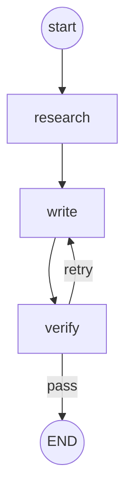

# simple-graph-agents

Zero-dependency Python graph runtime for small agent loops.

Nodes are **plain functions** that take and return a shared `dict` state. Wire them with fixed edges or **conditional edges** (a router function returns the next node name). Call `render_mermaid()` for instant control-flow diagrams.

```
research ──► write ──► verify ──► END
                ▲         │
                └─ retry ─┘
```

## Why

Most agent frameworks bury the control plane under adapters, schemas, and vendor SDKs. This repo is intentionally tiny:

- one file core ([`simple_graph.py`](simple_graph.py))
- no required third-party packages
- Mermaid out of the box (optional Graphviz if you want images)
- a research → write → verify example with test feedback

## Install

Nothing to install for the runtime.

```bash
git clone <your-fork>/simple-graph-agents
cd simple-graph-agents
python examples/research_write_verify.py
```

Optional image export:

```bash
pip install graphviz   # also need system graphviz binaries
```

## Quick start

```python
from simple_graph import Graph, END

def research(state):
    state["notes"] = ["fact A", "fact B"]
    return state

def write(state):
    state["draft"] = " ".join(state.get("notes", []))
    return state

def verify(state):
    state["passed"] = len(state.get("draft", "")) > 10
    return state

def route(state):
    return "pass" if state.get("passed") else "retry"

g = Graph()
g.add_node("research", research)
g.add_node("write", write)
g.add_node("verify", verify)
g.set_entry("research")
g.add_edge("research", "write")
g.add_edge("write", "verify")
g.add_conditional_edges(
    "verify",
    route,
    path_map={"pass": END, "retry": "write"},
)

result = g.run({"topic": "agents"})
print(result["draft"])
print(g.render_mermaid())
```

## API

| Method | Purpose |
|--------|---------|
| `add_node(name, fn)` | Register `fn(state: dict) -> dict` |
| `add_edge(src, tgt)` | Fixed edge; `tgt` may be `END` |
| `add_conditional_edges(src, router, path_map=None)` | `router(state) -> str` next node (or key into `path_map`) |
| `set_entry(name)` | Where `run` starts |
| `run(state, max_steps=50, verbose=False)` | Execute until `END` |
| `render_mermaid()` / `render(path=None)` | Mermaid flowchart string |
| `render_graphviz(path=None, format="png")` | DOT (+ optional render via `graphviz` package) |
| `history` | Node trail from last run (includes `END`) |

`END` is the reserved terminal sentinel (`"__end__"`).

## Mermaid visualization

Any graph prints paste-ready Mermaid:

```python
print(g.render_mermaid())
# or
g.render("graph.mmd")
```

Paste into:

- [mermaid.live](https://mermaid.live)
- GitHub / GitLab markdown fenced as ` ```mermaid `
- the local demo under [`demo/`](demo/)

Example output from the research/write/verify loop:



## Example: research → write → verify

```bash
python examples/research_write_verify.py
```

What it shows:

1. **research** — fills `state["notes"]`
2. **write** — builds `state["draft"]`, using `state["feedback"]` on retries
3. **verify** — runs lightweight checks; first pass intentionally fails so you see the loop
4. **router** — `"retry"` → `write`, `"pass"` → `END`

Also writes [`demo/graph.mmd`](demo/graph.mmd) for the web viewer.

## Web demo (vanilla JS)

Static page; Mermaid is loaded from a CDN. No build step.

```bash
# generate demo/graph.mmd
python examples/research_write_verify.py

# serve the folder
python -m http.server 8765 --directory demo
# open http://localhost:8765
```

Edit the source pane and hit **Render**, or paste output from `render_mermaid()`.

## Design notes

- **State is a dict.** Nodes may mutate and return the same object, or return a new dict.
- **No async / streaming.** Add it in the node body if you need it.
- **No LLM client.** Swap stubs in the example for your provider of choice.
- **Cycles are allowed** (retry loops). Guard with `max_steps`.
- **Routers return strings.** Prefer `path_map` so Mermaid edge labels stay stable.

## Layout

```
simple-graph-agents/
├── simple_graph.py              # Graph, END, Mermaid / DOT
├── examples/
│   └── research_write_verify.py # research → write → verify loop
├── demo/
│   ├── index.html               # vanilla JS Mermaid viewer
│   └── graph.mmd                # generated by the example
└── README.md
```

## License

MIT — use it, fork it, keep it small.
