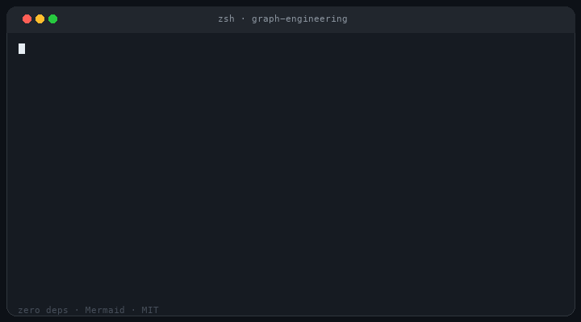
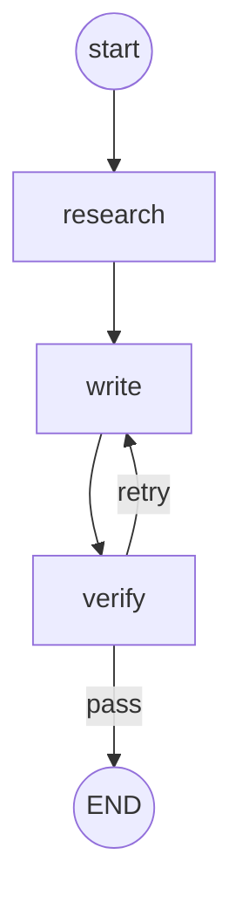

# Graph Engineering

<p align="center">
  
</p>

<p align="center">
  <strong>LangGraph energy. Zero dependencies. ~400 lines of readable Python.</strong>
</p>

<p align="center">
  Nodes are plain functions. Edges are fixed or conditional.<br/>
  Control flow you can <em>see</em> — Mermaid, ASCII, Graphviz.
</p>

<p align="center">
  <a href="https://github.com/cobusgreyling/graph-engineering/actions/workflows/ci.yml"></a>
  <a href="https://pypi.org/project/simple-graph-agents/"></a>
  <a href="LICENSE"></a>
  <a href="https://www.python.org/downloads/"></a>
  
  <a href="https://pypi.org/project/simple-graph-agents/"></a>
  <a href="https://cobusgreyling.github.io/graph-engineering/"></a>
</p>

<p align="center">
  
</p>

<p align="center">
  <em>~20s demo — install, run the retry loop, print the trail + Mermaid.</em>
</p>

---

## The pitch

Most agent frameworks bury the **control plane** under adapters, schemas, vendors, and 40 transitive packages.

**Graph Engineering** is the opposite:

| You write | You get |
|-----------|---------|
| `fn(state: dict) -> dict` | A real agent loop |
| Fixed + conditional edges | Retries, routers, handoffs |
| `g.render_mermaid()` | Paste-ready diagrams |
| **Nothing** on `pip` | Runs on stdlib alone |

```
research ──► write ──► verify ──► END
                ▲         │
                └─ retry ─┘
```



**Use this** for teaching, prototypes, demos, notebooks, and tiny production loops where you want the graph to fit in your head.

**Use LangGraph** (or similar) when you need durable checkpoints, streaming platforms, or multi-actor infra at scale.

---

## 30-second quickstart

```bash
pip install simple-graph-agents
```

```python
from simple_graph_agents import Graph, END

g = (
    Graph("demo")
    .node("research", lambda s: {**s, "notes": ["fact A", "fact B"]})
    .node("write",    lambda s: {**s, "draft": " ".join(s["notes"])})
    .node("verify",   lambda s: {**s, "ok": len(s.get("draft", "")) > 5})
    .entry("research")
    .edge("research", "write")
    .edge("write", "verify")
    .branch(
        "verify",
        lambda s: "pass" if s["ok"] else "retry",
        path_map={"pass": END, "retry": "write"},
    )
)

result = g.run({"topic": "agents"}, timed=True)
print(result.state["draft"])
print(result.trail())          # research -> write -> verify -> __end__
print(g.render_mermaid())      # paste into GitHub / mermaid.live
print(g.render_ascii())        # terminal sketch
```

Clone-and-run without install:

```bash
git clone https://github.com/cobusgreyling/graph-engineering.git
cd graph-engineering
python examples/minimal.py
python examples/research_write_verify.py
```

Live Mermaid viewer (no backend): **[demo →](https://cobusgreyling.github.io/graph-engineering/)**

---

## Why people star this

1. **Zero dependencies** — audit the whole runtime in one file
2. **Inspectable** — Mermaid + ASCII + Graphviz + `RunResult.trace`
3. **Honest scope** — not a platform; a sharp knife for control flow
4. **Teaching-grade API** — `node` / `edge` / `branch` / `chain` / `validate`
5. **Copy-paste examples** — research loops, tool routers, multi-agent handoffs

---

## vs LangGraph (honest)

| | **Graph Engineering** | **LangGraph** |
|--|----------------------|---------------|
| Install size | **0** runtime deps | Full stack |
| Mental model | Functions + dict state | Channels, reducers, checkpointers |
| Visualization | Mermaid / ASCII / DOT built-in | External / ecosystem |
| Durable execution | No (by design) | Yes |
| Streaming platform | No | Yes |
| Best for | Learn, demo, ship small loops | Production multi-actor systems |
| Lines of core | ~400 | Large framework |

If LangGraph is an airport, this is a bicycle. Both move people. Pick the right vehicle.

---

## Install

```bash
pip install simple-graph-agents
```

From GitHub (main) or editable with tests:

```bash
pip install "git+https://github.com/cobusgreyling/graph-engineering.git"

git clone https://github.com/cobusgreyling/graph-engineering.git
cd graph-engineering
pip install -e ".[dev]"
pytest -q
```

Optional image export:

```bash
pip install "simple-graph-agents[graphviz]"   # + system graphviz binaries
```

| | |
|--|--|
| **PyPI** | [`simple-graph-agents`](https://pypi.org/project/simple-graph-agents/) |
| **Import** | `simple_graph_agents` |
| **Brand** | **Graph Engineering** |

---

## Examples

| Script | Pattern |
|--------|---------|
| [`examples/minimal.py`](examples/minimal.py) | Smallest possible graph |
| [`examples/research_write_verify.py`](examples/research_write_verify.py) | Retry loop with test feedback |
| [`examples/tool_router.py`](examples/tool_router.py) | Plan → tool → observe → replan |
| [`examples/multi_agent_handoff.py`](examples/multi_agent_handoff.py) | Researcher → writer → critic |

```bash
python examples/tool_router.py
python examples/multi_agent_handoff.py
```

---

## API cheatsheet

| Method / type | Purpose |
|---------------|---------|
| `add_node` / `node` | Register `fn(state: dict) -> dict` |
| `add_edge` / `edge` | Fixed edge; target may be `END` |
| `add_conditional_edges` / `branch` | `router(state) -> str` (+ optional `path_map`) |
| `chain("a", "b", "c")` | Linear path; adds edge to `END` by default |
| `set_entry` / `entry` | Where `run` starts |
| `validate()` | Reachability check (also `run(..., validate=True)`) |
| `run(state, max_steps=50, verbose=False, on_step=None, timed=False)` | Execute → `RunResult` |
| `RunResult.state` / `.history` / `.steps` / `.trace` / `.trail()` | Inspect the run |
| `render_mermaid()` / `render(path)` | Mermaid flowchart |
| `render_ascii()` | Terminal sketch |
| `render_graphviz(path=None, format="png")` | DOT (+ optional image) |
| `edges()` | `(source, target, label)` triples |
| `GraphError` | Definition and runtime errors |

`END` is the reserved terminal sentinel (`"__end__"`).

### State notes

- Input state is **shallow-copied**; nested lists/dicts are shared with the caller.
- Nodes may mutate and return the same object, or return a new dict.
- A node with no outgoing edge **implicitly ends** (routes to `END`).
- Cycles are allowed; guard with `max_steps`.

### Fluent style

```python
g = (
    Graph("pipeline")
    .node("a", fa)
    .node("b", fb)
    .entry("a")
    .chain("a", "b")   # a → b → END
    .validate()
)
result = g.run({}, timed=True, validate=True)
```

---

## Mermaid & web demo

```python
print(g.render_mermaid())
g.render("graph.mmd")
```

Paste into [mermaid.live](https://mermaid.live), GitHub markdown fences, or the local viewer:

```bash
python examples/research_write_verify.py
python -m http.server 8765 --directory demo
# open http://localhost:8765
```

Deployed demo: https://cobusgreyling.github.io/graph-engineering/

---

## Design notes

- **State is a dict.** No schema engine required.
- **No async / streaming.** Add it inside the node if you need it.
- **No LLM client.** Swap stubs for OpenAI / Anthropic / local models.
- **Routers return strings.** Prefer `path_map` so Mermaid labels stay stable.
- **Duplicate edges raise.** No silent overwrites.
- **`validate()`** catches unreachable nodes before you ship a broken graph.

---

## Layout

```
graph-engineering/
├── simple_graph_agents/     # installable package
│   ├── __init__.py
│   ├── graph.py             # Graph, END, RunResult, renderers
│   └── py.typed
├── simple_graph.py          # clone-and-run shim
├── examples/
│   ├── minimal.py
│   ├── research_write_verify.py
│   ├── tool_router.py
│   └── multi_agent_handoff.py
├── demo/                    # vanilla JS Mermaid viewer
├── tests/
├── pyproject.toml
└── README.md
```

---

## Development

```bash
pip install -e ".[dev]"
pytest -q
```

CI runs on Python **3.9–3.13** and executes every example.

---

## Launch & growth

Stars don't appear from code alone. See **[LAUNCH.md](LAUNCH.md)** for a practical playbook (HN, Reddit, X, blogs, demo GIFs).

If this saved you a dependency tree or taught a teammate agent control flow — **star the repo** and share the Mermaid of your graph. That's the whole marketing plan.

---

## License

MIT — use it, fork it, keep it small.

Built by [Cobus Greyling](https://github.com/cobusgreyling) · part of the *Engineering* series for builders who want mechanisms, not magic.
